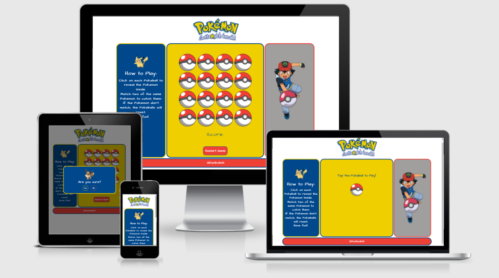

<h1 align="center">Pokemon Match</h1>
<h2 align="center">Gotta Match 'Em All!</h2>

This is a simple memory match game based on Pokemon. The user tests their memory skills by matching up pairs of the same hidden Pokemon characters by turning over cards on the board to reveal them. The game is complete when all pairs have been matched.

Play the game [here.](https://danbob81.github.io/Pokemon_Match/)

<h4 align="center"></h4>

## User Experience (UX) 
- ### User Stories
    - I would like to play a simple game to test my memory by matching up pairs of images
    - I expect feedback to confirm each matching pair made and the matched images remain on show
    - I expect to see my score
    - I expect confirmation that I have completed the game successfully
    - I would like the option to restart/replay the game 
    - I expect to be able to play on different devices (laptop, mobile tablet)
    - I expect to have fun! :)

- ### Design
    - ### Colour scheme:
        - Colours used on the game to match the blue, yellow and red of the official Pokemon colour scheme
    - ### Typography:
        - Google Fonts - [ArchitectsDaughter](https://bit.ly/3EwQP1N)

- ### Wireframes

    - Wireframes created in Balsamiq for desktop, tablet and mobile views.

        PDF links here:
        - [Desktop](docs/readme_items/pokemon_match_wireframe_desktop.pdf)
        - [Tablet](docs/readme_items/pokemon_match_wireframe_tablet.pdf)
        - [Mobile](docs/readme_items/pokemon_match_wireframe_mobile.pdf)

## Features

- ### Implemented:
    - Game-play area which is the dominant section of the screen layout.
    - Rules area, slightly smaller, with simple game instructions.
    - Image section to the opposite side of the rules section balancing out the layout. NOTE: Only shows in desktop/laptop screen sizes.
    - Score shows under game board.
    - Replay button.

- ### Future features:
    - Timer - to be displayed showing time taken to play.
    - Scoreboard - to keep track of previous/other peoples scores/times

## Technologies used

- ### Languages:
    - HTML 5
    - CSS 3
    - Javascript

- ### Frameworks, libraries and programmes:
    - Google Fonts - font used [ArchitectsDaughter](https://bit.ly/3EwQP1N)
    - Bootstrap - used to create layout
    - JQuery - for additional JS functions
    - Git & Github - for version control
    - VS Code - IDE for writing HTML/CSS/Javascript/JQuery and file management
    - Balsamiq - for wireframes
    - WavePad Audio Editor - to edit audio files
    - Paint -  to edit image files
    
## Testing

I used the Chrome Developer Tool to simulate the different viewport sizes for desktop and laptop views, tablet views and mobile views. I used this throughout the development process as well as for testing the website once it was deployed to GitHub Pages.

The deployed website was also tested using Chrome, Edge and Firefox as well as on mobile (using Chrome for Android)

- ### User stories' testing:
    - I would like to play a simple game to test my memory by matching up pairs of images
        - Memory match game uses Pokemon images to test the users memory - hidden images are arranged at random and change position each time the game is loaded
    - I expect feedback to confirm each matching pair made and the matched images remain on show
        - sound effects play at game load stage, with each card turn-over, with each non successful and successful matching and successful game completion. Matched image pairs remain on show
    - I expect to see my score
        - score is displayed below the game grid
    - I expect confirmation that I have completed the game successfully
        - on successful game completion, a sound is played and a pop-up modal appears with a congratulaions message
    - I would like the option to restart/replay the game 
        - a button appears below the game grid giving the player the option to restart. This presents a pop-up with a yes/no confirmation option. There is also a replay button within the game completion pop-up modal
    - I expect to be able to play on different devices (laptop, mobile tablet)
        - the game was tested, and works, on desktop/laptop, tablet and mobile
    - I expect to have fun! :)
        - I had fun! :)

- ### Validator testing:
    - HTML - [W3C Validator](https://bit.ly/31qLrPD) - passed
    - CSS - [(Jigsaw) validator](https://bit.ly/3F29Zg1) - passed
    - Javascript - [JSHint](https://jshint.com/) - passed
- ### Additional testing:
    Black box testing was also carried out on the final deployed website.
    
    All tests passed. Results can be viewed [here](docs/readme_items/website_test_plan.pdf)

- ### Bugs
    - Game grid layout displayed differently at certain mobile screen sizes (iPhone 5/SE in particular). To overcome this issue I adjusted the width percentage for the grid images.
    - Restart game button was being pushed below the bottom line of the game section at larger screen sizes (above 1400px). To correct this I adjusted the bottom margin of the game grid.

## Deployment
### Github Pages
- Site deployed to Github Pages using the following process:
    - Click the 'Settings' tab in the GitHub repository
    - Select 'Pages' in the left hand menu
    - Under the heading of 'Source', select 'Master Branch' from the drop-down menu
    - Click 'Save'

## Credits

### Content:
- Javascript content based on this YouTube video tutorial: [Learn JavaScript by Building 7 Games - Full Course](https://bit.ly/3D45TUl) 
from [freeCodeCamp](https://bit.ly/3bZtVE8) 
 
### Media:
- Pokemon logo taken from [pngitem.com](https://bit.ly/2ZPHsvp)
- Ash image taken from [pngitem.com](https://bit.ly/3jWp1Mf)
- Pokemon images taken from [The Official Pokemon Website](https://bit.ly/3w0eDIa)
- Pokemon sounds taken from Zedge 
    - [Pokeball Catch by julianoc](https://bit.ly/3pX7PtN) - note: I edited the original mp3 file to create three separate files using WavePad Audio Editor (free download from Microsoft Store)
    - [pokemon go R Close by Sivilian](https://bit.ly/3bt0bPF)
    - [Pokemon Joins Team by AlberStelar](https://bit.ly/3mArm12)
    - [pokemon GO level up by Coolbuddyn](https://bit.ly/3BtOToV)

### Acknowledgements:
- Code Institute for the lessons and support
- My mentor Rohit Sharma for the helpful suggestions and guidance he has given during this project
- Patrick Justus for the additional lessons and insights into web development

